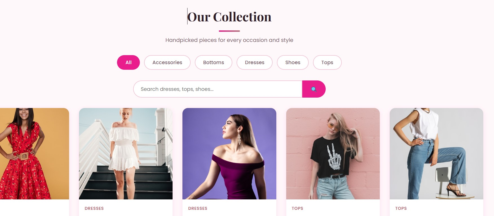
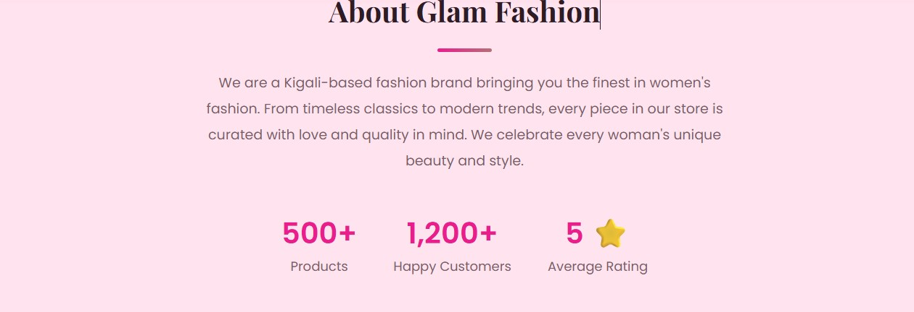
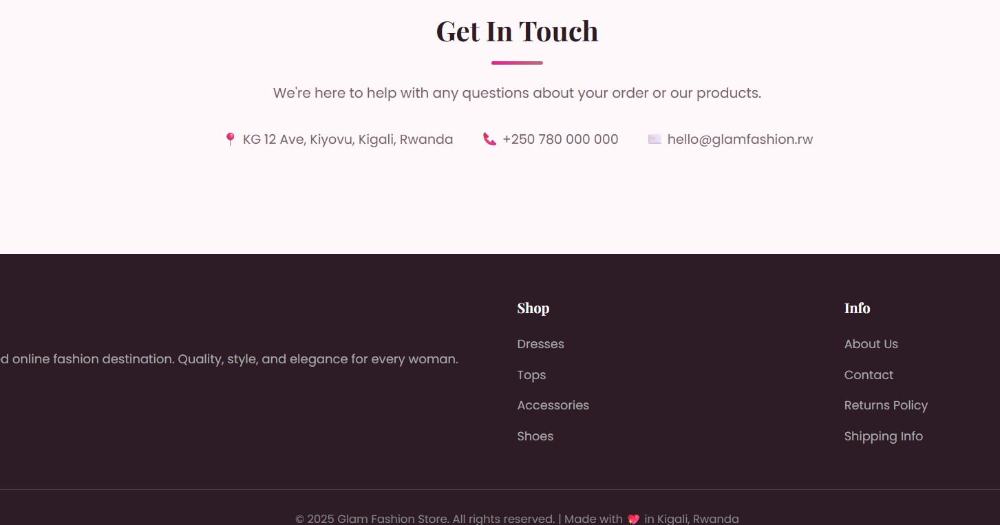

# 👗 Glam Fashion Store – Your Style, Your Story

A chic, fully responsive e-commerce storefront designed for a curated boutique fashion brand based in Kigali, Rwanda. The web application features an elegant design style, a dynamic product grid with live category filtering, an interactive shopping cart, and a structured PHP/MySQL backend architecture.

---

## 👤 Developer Information
* **Student Name: Divine NSHUTI
* **Student ID:24140/2024
* **Course/Class:E-commerce and web Application
* **Institution:UNIVERSITY OF LAY ADVENTIST OF KIGALI (UNILAK)

---

## 📑 Project Overview
* **Project Title:** Glam Fashion Store E-Commerce Frontend & Backend Connection
* **Platform Used:** Web Browser (Desktop, Tablet, Mobile)
* **Target Location:** Kigali, Rwanda

---

## ✨ Features Implemented

### 🎨 Frontend UI/UX
* **Elegant Visual Theme:** Premium layout utilizing custom typography (`Playfair Display` and `Poppins`) alongside smooth interactive transitions.
* **Responsive Layout:** Fluid designs using CSS Flexbox and Grid, optimizing performance seamlessly from small smartphone screens to wide desktop monitors.
* **Interactive Navigation & Hero:** Sticky navigation layout paired with a clean call-to-action hero banner introducing seasonal collections.

### 🛍️ E-Commerce Logic
* **Dynamic Product Filtering:** Category control tags ("All", "Accessories", "Bottoms", "Dresses", etc.) allowing instant inventory updates.
* **Live Product Search:** Interactive search bar element to seamlessly crawl item listings.
* **Slide-out Cart & Checkout Modal:** Animated shopping cart component managing real-time calculations alongside an embedded user checkout form.

### ⚙️ Backend & Architecture
* **Modular Configuration:** Clean abstraction separating backend logic (`api.php`), configuration constraints (`db.php`), and core views (`index.php`).
* **Secure Database Connection:** MySQL object-oriented `mysqli` database mapping built to dynamic JSON response error frameworks.

---

## 📸 Interface Screenshots

### 🌅 1. Hero Section
Features a clean collection introduction banner alongside vibrant marketing highlights.

### 🛒 2. Dynamic Shop Catalog
Showcases category filter structures, interactive search controls, and the foundational responsive layout structure.

### 📈 3. Metrics & About Brand
Includes live metrics showing historical user tracking metrics and store data.

### 📍 4. Contact & Footer Frameworks
Contains localized geographic markers for Kiyovu, Kigali, alongside unified secondary page mapping links.

---

## 🚀 Technical Architecture & Stack
